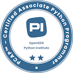

# 🖥️ PCAP - Certified Associate in Python Programming


🔗 [Ver mi insignia en Credly](https://www.credly.com/badges/7384e3c4-bcb2-4d0d-966a-74cd339efdf6/public_url)

## 📌 Descripción
Este repositorio contiene materiales y ejercicios utilizados en mi preparación para la certificación **PCAP - Certified Associate in Python Programming**. A través de estos archivos, abordo conceptos fundamentales de Python con ejemplos prácticos.

## 📂 Contenido

🔹 **Módulo 1: módulos y paquetes**  
🔹 **Módulo 2: cadenas, métodos de listas y excepciones**  
🔹 **Módulo 3: programación orientada a objetos**  
🔹 **Módulo 4: misceláneo** (manejo de archivos, función lambda, generadores y cierres...) 

## 🚀 Requisitos

Para ejecutar los ejercicios, necesitas tener instalado:
- **Python 3.12** → [Descargar Python](https://www.python.org/downloads/)
- Un editor de código como **VS Code**, **PyCharm** o simplemente usar la terminal.
  
## 🛠️ Tecnologías utilizadas
- **Python** 🐍
- **Visual Studio Code** 💻
- **Google Colab** ☁️

## ▶️ Cómo usar este repositorio

1. Clona el repositorio en tu máquina local:
   ```sh
   git clone git@github.com:crispadomin/pcep.git
   ```
2. Navega dentro del repositorio:
   ```sh
   cd pcep
   ```
3. Ejecuta los scripts de Python:
   ```sh
   python archivo.py
   ```
   
## 📝 Contribuciones

Si deseas contribuir con ejercicios adicionales o mejoras, puedes hacer un **fork** del repositorio y enviar un **pull request**.

## 📜 Recursos adicionales
- [Documentación oficial de Python](https://docs.python.org/3/)
- [Página oficial de la certificación PCAP](https://pythoninstitute.org/pcap)

## 📬 Contacto
Si tienes alguna pregunta o sugerencia, ¡no dudes en contactarme! 😊
