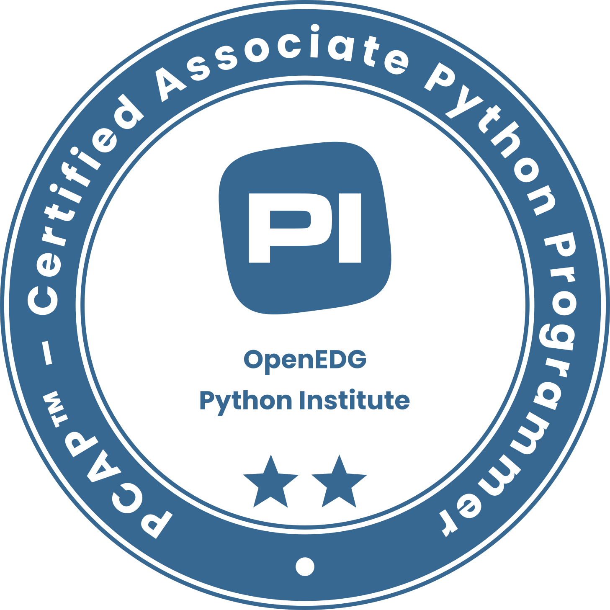

# 🖥️ PCAP - Certified Associate in Python Programming


🔗 [Ver mi insignia en Credly](https://www.credly.com/badges/7384e3c4-bcb2-4d0d-966a-74cd339efdf6/public_url)

## 📌 Descripción
Este repositorio contiene materiales y ejercicios utilizados en mi preparación para la certificación **PCAP - Certified Associate in Python Programming**. A través de estos archivos, abordo conceptos fundamentales de Python con ejemplos prácticos.

## 📂 Contenido

🔹 **Módulos y paquetes**  
🔹 **Estructuras de datos** (listas, tuplas, diccionarios, conjuntos) 
🔹 **Listas** (método y comprensión de listas) 
🔹 **Estructuras de control** (bucles, condicionales)  
🔹 **Funciones lambda**  
🔹 **Programación orientada a objetos (OOP)**  
🔹 **Manejo de excepciones**  
🔹 **Generadores y cierres**  
🔹 **Trabajando con archivos**  

## 🛠️ Tecnologías utilizadas
- **Python** 🐍
- **Visual Studio Code** 💻
- **Google Colab** ☁️

## 🚀 Uso
Puedes clonar este repositorio con el siguiente comando:
```bash
git clone git@github.com:crispadomin/pcap.git
```

Para ejecutar los scripts, simplemente usa:
```bash
python nombre_del_script.py
```

## 📜 Recursos adicionales
- [Documentación oficial de Python](https://docs.python.org/3/)
- [Página oficial de la certificación PCAP](https://pythoninstitute.org/pcap)

## 📬 Contacto
Si tienes alguna pregunta o sugerencia, ¡no dudes en contactarme! 😊
